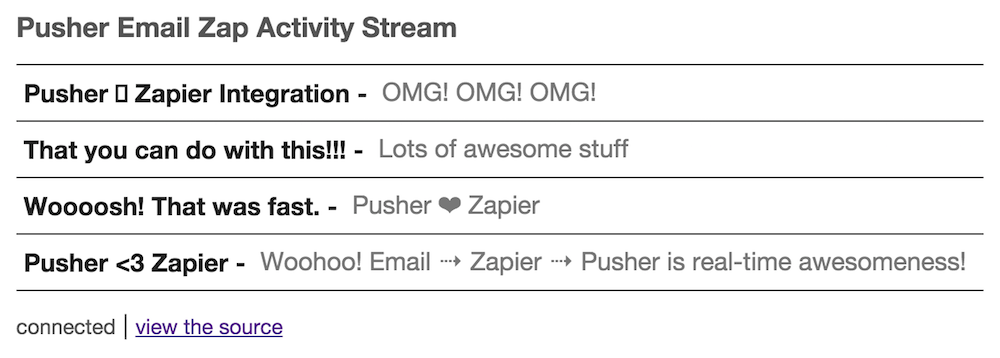

# Pusher Email Zap Activity Stream

A Web Component created to display an activity stream for the Pusher integration with Zapier.



This specifically creates an activity stream based on events it receives with the following characteristics:

* Events are triggered on a channel named `email`
* The events are named `new_email`
* The event data payload has` `subject` and `body` properties

This Pusher Zapier Integration App that this Web Component uses is in Beta. You are hereby invited to try it out by visiting https://zapier.com/developer/invite/20707/d25cf0a67528ad6e7bccc37cab194c5d/

You can read more about the Pusher Zapier integration here:
**TODO: update when blog post goes out**

## Usage

Include the webcomponents.js polyfill

```html
<script src="//cdnjs.cloudflare.com/ajax/libs/webcomponentsjs/0.6.1/webcomponents.min.js"></script>
```

Link in the Pusher Email Zap Activity Stream

```html
<link rel="import" href="//leggetter.github.io/pusher-email-zap-as/pusher-email-zap-as.html" />
```

Use the `pusher-email-zap-as` tag with the following attributes:

* `app-key` - the Pusher Application key to connect to and through which the events are being triggered
* `debug` - *optional* log debug information to the browser console
* `cluster` - *optional* lets you set the Pusher cluster to connect to

Example:

```html
<pusher-email-zap-as app-key="b9441efbc094b5934835" debug></pusher-email-zap-as>
```